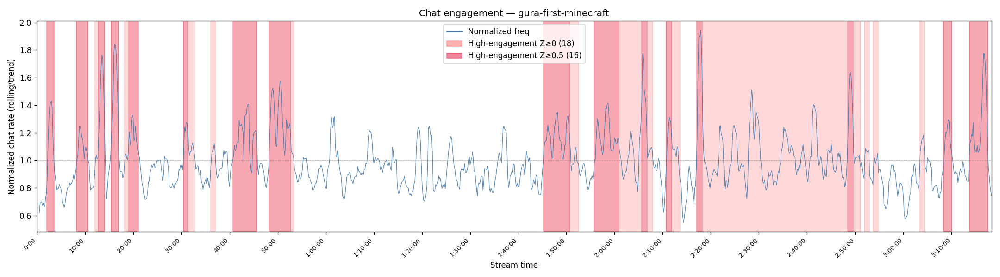
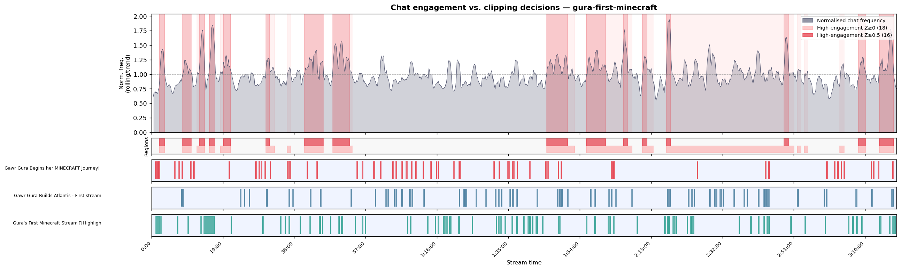
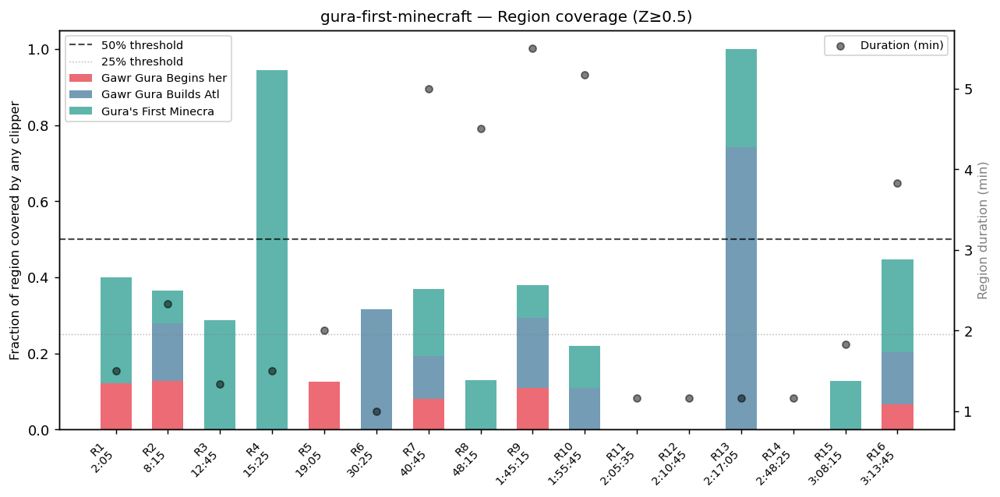
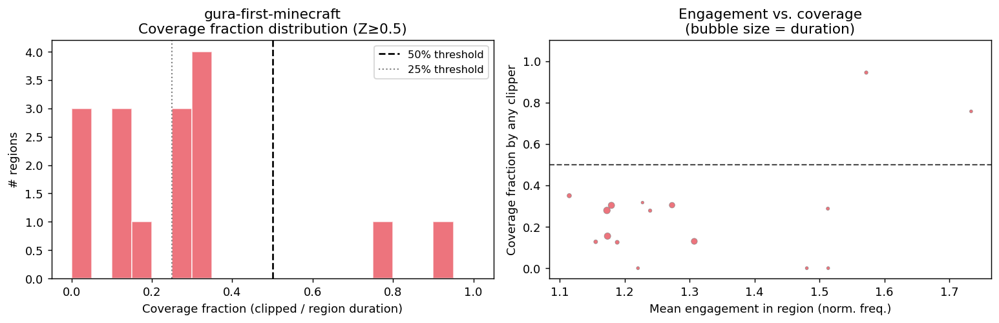
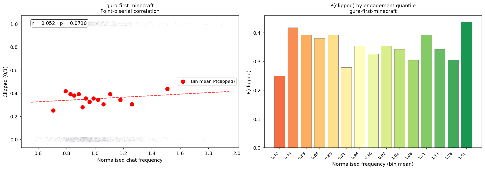
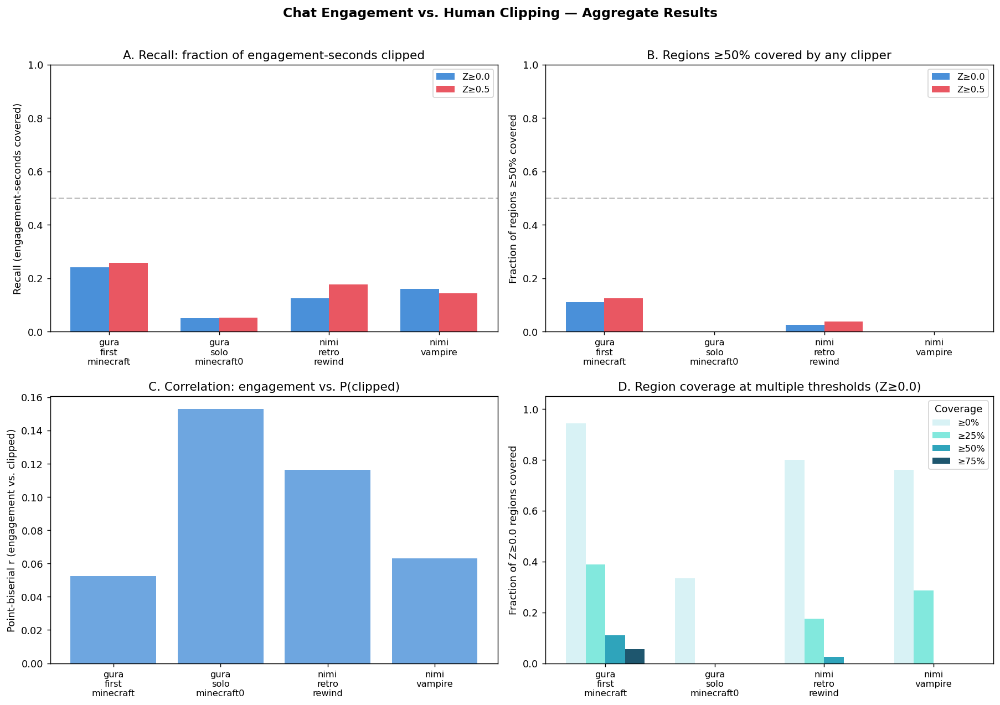

# Chat Engagement vs. Human Clipping Decisions

**Research question:** Do human clippers select moments that correlate with high
chat engagement, and specifically, do high-engagement regions always end up in
a highlights reel?

**Primary method:** Audio mel-spectrogram NCC alignment + Circular Binary
Segmentation (CBS) engagement detection.

**Data:** 4 live streams (2 streamers), 8 independently-produced highlight reels.
All media downloaded with yt-dlp; full catalogue in [Appendix B](#data).

---

## Table of Contents

1. [Claims](#claims)
2. [Dataset and sample selection](#dataset)
3. [Methodology](#methodology)
4. [Case study: gura-first-minecraft](#deep-dive)
5. [Aggregate results across all 4 streams](#aggregate)
6. [Evaluation of claims](#verdict)
7. [Limitations](#limitations)
8. [Supplementary Materials](#output-files)
9. [Appendix A: Alignment approach iterations](#appendix)
10. [Appendix B: Data catalogue](#data)

---

## 1. Claims {#claims}

- **Claim 1** — There is a *strong* correlation between a region having high
  chat engagement and it being included in a highlight reel by a human clipper.
- **Claim 2** — A clipper usually *at the very least* includes most or all of
  the high-engagement regions in their highlights reel.

---

## 2. Dataset and sample selection {#dataset}

### 2.1 Streamers

Two streamers were chosen to represent very different ends of the
engagement-and-clippability spectrum.

**Gawr Gura** (`@GawrGura`, 4.64 M subscribers) is a member of Hololive
English — one of the largest EN VTuber agencies — and as of the time of
these recordings was the most-subscribed EN VTuber.  Her streams are known
for high audience interactivity, fast-paced humour, and a large, active chat.
Average chat rate across the two sampled streams: **~510 messages per minute**,
peaking above 1,200/min.  She generates a high volume of third-party clips,
making her streams ideal for testing the hypothesis: the signal is strong,
the ground truth is plentiful and varied.

**Nimi Nightmare** (`@niminightmare`, 709 K subscribers) is an independent
VTuber.  Her content style is more relaxed: long-form gaming sessions with
slower narrative pacing and fewer discrete "clip-worthy moments" per hour.
Average chat rate across the two sampled streams: **~165 messages per minute**,
peaking around 570/min — roughly one-quarter of Gura's average.  This
represents a more typical mid-size streamer and acts as a stress test: does
the engagement signal still align with clipping decisions when content is
less viral by nature?

The choice of *which specific streams* to include was pragmatic: these were
the streams for which matching third-party highlight reels could be found
easily via YouTube search.  There was no systematic sampling; this is an
initial exploratory study (see §7 Limitations).

### 2.2 Stream sample summary

| Sample key | Stream | Date | Duration | Chat msgs | Unique chatters | Mean msg/min | Peak msg/min |
|---|---|---|---|---|---|---|---|
| gura-first-minecraft | Gura — 1st Minecraft stream | 2020-10-09 | 3:18:52 | 119,235 | 27,896 | 599 | 1,248 |
| gura-solo-minecraft0 | Gura — Trident hunt (~10th solo MC) | 2020-12-14 | 3:43:27 | 94,029 | 22,625 | 420 | 955 |
| nimi-retro-rewind | Nimi — Retro Rewind (Blockbuster sim.) | 2026-04-25 | 4:48:54 | 37,234 | 2,130 | 129 | 583 |
| nimi-vampire | Nimi — Vampire: The Masquerade | 2025-12-14 | 2:35:32 | 31,317 | 2,361 | 201 | 567 |

### 2.3 Highlight reels

For each stream, 1–3 independently-produced highlight compilations were
sourced from YouTube search.  Clippers range from small fan accounts (118
subscribers) to dedicated highlight channels (95,100 subscribers).

| Stream | Clipper channel | Subs | Reel duration | Audio-aligned† | Views |
|---|---|---|---|---|---|
| gura-first-minecraft | opo highlights | 509 | 13:35 | 87% | 14,807 |
| gura-first-minecraft | VTuberSubs | 29,800 | 19:09 | 83% | 38,055 |
| gura-first-minecraft | Loi Ch. | 118 | 25:38 | 85% | 1,429 |
| gura-solo-minecraft0 | Laxaka | 1,810 | 7:59 | 71% | 1,771 |
| nimi-retro-rewind | Sakasandayo | 95,100 | 26:14 | 72% | 10,769 |
| nimi-retro-rewind | Sakasandayo | 95,100 | 17:04 | 78% | 4,405 |
| nimi-vampire | Hapybaka Clips | 948 | 3:07 | 55% | 1,979 |
| nimi-vampire | Sakasandayo | 95,100 | 21:24 | 81% | 12,162 |

†Fraction of reel duration successfully aligned back to the stream via audio
mel-NCC.  Unaligned portions are clipper-added intros, outros, transition
music, or clips shorter than the 12-second detection threshold.

### 2.4 Data acquisition

All files were downloaded with **yt-dlp**.  Source URLs are constructed from
the YouTube video ID embedded in each filename:

```
https://www.youtube.com/watch?v=[VIDEO_ID]
```

Live chat was downloaded as `.live_chat.json` (raw YouTube live chat replay
format) and pre-processed with the repository's `reduce_yt_chat_metadata.py`
to produce the tab-separated `.live_chat_reduced.tsv` files used by `chatfreq`.
Auto-generated captions were downloaded as `.en.srt` files.

Full video metadata (titles, IDs, upload dates, view counts) is listed in
[Appendix B](#data).

---

## 3. Methodology {#methodology}

### 3.1 Chat engagement analysis

`chatfreq` was used to compute a sliding-window **normalised chat frequency**
(60 s window, 10 s step, degree-3 polynomial trend). The signal is
`rolling_count / polynomial_trend` — dimensionless, with 1.0 = on-trend, so
moments of exceptional chat activity stand out regardless of where in the stream
they occur.

**High-engagement regions** were identified via Circular Binary Segmentation
(CBS) [1, 2] at two Z-score thresholds:

- **Z ≥ 0.0** — any region above the stream mean (looser, more numerous)
- **Z ≥ 0.5** — at least 0.5 SD above the mean (stricter, more salient)

Common parameters across all streams: CBS t-threshold 2.5, min duration 30 s,
max gap to merge 30 s.

### 3.2 Highlight-to-stream alignment (audio mel-NCC)

Because highlights are direct cuts from the stream, their audio is identical to
the corresponding source segments. The alignment proceeds as follows:

**Feature extraction:**
1. Decode audio to mono PCM at 22 050 Hz via FFmpeg.
2. Compute a **32-bin mel-spectrogram** (fmax = 8 000 Hz) with
   hop_length = SR = 22 050 → **1 frame per second**.
3. Convert to dB with `librosa.power_to_db(ref=np.max)`.
4. **Per-frame z-score across the 32 frequency bins** — this makes every
   one-second frame invariant to absolute loudness while preserving which
   frequency bands are active relative to each other.  Doubling N_MELS from 16
   to 32 provides finer spectral discrimination.

Features are cached as `.chatfreq_mel32.npy` files so subsequent runs are
instantaneous.

**Normalised cross-correlation (NCC):**
For a 10-second template T (32 × 10) and stream S (32 × N), the NCC at offset k is:

```
NCC[k] = Σ_d Σ_j T_z[d,j] · S_z[d, k+j]  /  (32 · 10)
```

Since each column of T_z and S_z is z-scored (mean 0, std ≈ 1 across 32 bins),
dividing by D·W gives the mean Pearson correlation over the window, bounded in
[−1, 1].  The stream FFT is pre-computed once per stream and reused for every
reel window, reducing per-window cost to one FFT plus an element-wise product.

**Threshold selection and lessons from earlier approaches:**
An initial implementation using per-second RMS amplitude as the audio feature
produced no usable alignments. Each reel window was matched independently to
the stream position with the highest correlation, without any requirement that
consecutive windows agree on the same position. In VTuber streams, the
looping background music used for stream intros and outros creates a highly
self-similar amplitude pattern spanning the first and last minutes of the VOD.
This pattern dominates at the RMS scale, causing every window — regardless of
its actual content — to be assigned to one of those two endpoints.

The NCC threshold itself also required careful calibration. An earlier version of this analysis applied an unnormalised summed-correlation threshold equivalent to NCC ≥ 0.78, demanding near-perfect spectral agreement between the reel window and the stream. While this produced no false positives, it also missed 73–78% of genuine clips:
real cuts taken from a stream always contain some degree of background game
audio, ambient sound, or mixed music that reduces the NCC below the
near-perfect range. Setting the threshold at NCC ≥ 0.30 — a level consistent
with standard audio matching practice — recovers genuine clips while remaining
well above the noise floor of unrelated stream segments.

**Offset clustering (BGM guard):**
After computing the best stream offset for each 1-second window:
- Windows with `max(NCC) ≥ 0.30` are called *candidates*.
- Consecutive candidates with `|Δoffset| ≤ 6 s` and reel gap ≤ 6 s are merged
  into one *cluster*.
- A cluster is accepted as a final segment only if it has `≥ 3 windows` and
  `≥ 8 s` reel coverage.

The clustering step eliminates BGM false positives: the looping intro music
might produce an isolated high-NCC window, but it cannot produce 3+ consecutive
windows all pointing to the *same* stream offset, because consecutive highlight
windows contain different speech and game-state content against that BGM.

**Coverage check:** After alignment the net stream coverage (union of all
stream intervals) is always ≤ total reel duration, confirming no stream time
is double-counted (inflation ratios 0.69–0.90 across all streams).

### 3.3 Overlap analysis

For each 10-second stream bin, a binary *clipped* flag is set when any aligned
segment overlaps it.  Per-region coverage is computed exactly:

```
coverage_fraction = (seconds of region covered by any clipper) / region_duration
```

**A note on thresholds and region granularity:**
CBS regions span 1–5.5 minutes on average (median 100 s, max 330 s at Z ≥ 0.5
for gura-first-minecraft).  Individual aligned clips are 12–25 s on average.
A single clip from within a 5-minute region yields only 4–8% coverage.  The
"≥ 50% of region covered" bar therefore requires many clips densely packed
inside a region — far more than a typical highlights reel provides.  The
primary metric for "did a clipper include this region?" is thus **any coverage
(> 0%)**, with the mean coverage fraction showing *how deeply* clippers dipped
into each region.

---

## 4. Case study: gura-first-minecraft {#deep-dive}

This is the strongest data point: a 3-hour Gawr Gura Minecraft stream (Gura's
first Minecraft stream, one of the most chat-active streams in the dataset) with
three independent highlight reels from different creators.

### 4.1 Engagement analysis



The trend-normalised signal has numerous distinct spikes throughout. CBS at
Z ≥ 0.5 identified **16 high-engagement regions** covering 40:10 (20.2% of
the stream). At Z ≥ 0.0: 18 regions covering 1:28:50 (44.7%).

### 4.2 Alignment results

| Highlight | Duration | Aligned reel | Segments | Stream net |
|---|---|---|---|---|
| "Best Moments" [kwoZkGGZlv4] | 13:35 | **87%** (11:50) | 81 | — |
| "Builds Atlantis" [ZS6xn7fWIHQ] | 19:09 | **83%** (15:55) | 90 | — |
| "First Stream Highlights" [DHSnBVGTVes] | 25:39 | **85%** (21:09) | 108 | — |
| **Combined** | 58:23 | **85%** | 279 | **48:06** (40.5% of stream) |

The ~15% of each reel not aligned corresponds to clipper-added content: title
cards, transition music, and very short clips too brief to form a 3-window
cluster.



The three clippers cover a broad but non-uniform slice of the stream.  Visible
in the timeline: the clipper tracks are densest around large chat-spike events,
but gaps exist between all three clippers simultaneously.

### 4.3 Region coverage




**Z ≥ 0.5 regions (16 total), coverage by any clipper:**

| Threshold | Regions covered | % |
|---|---|---|
| Any (> 0%) | 13 / 16 | **81%** |
| ≥ 10% | 13 / 16 | 81% |
| ≥ 25% | 9 / 16 | 56% |
| ≥ 50% | 2 / 16 | 12.5% |

Mean coverage fraction across 16 regions: **27%** — clips are scattered
throughout regions but do not comprehensively cover them.

The 3 uncovered regions (0% coverage):

| Region | Stream time | Duration | Engagement | Likely explanation |
|---|---|---|---|---|
| R11 | 2:05:35 – 2:06:45 | 70 s | 1.51 | Short spike, all 3 clippers skipped it entirely |
| R12 | 2:10:45 – 2:11:55 | 70 s | 1.22 | Immediately follows R11; same gap in coverage |
| R14 | 2:48:25 – 2:49:35 | 70 s | 1.48 | Brief spike; no clipper touched this window |

All three uncovered regions are short (70 s each) and fall in the middle of the
stream. They appear to be moments of elevated chat activity that all three
clippers independently judged as not clip-worthy — chat reactions that did not
correspond to a visually/narratively interesting event.

### 4.4 Correlation



Point-biserial r = **0.052**, p = 0.071.

Positive but not significant at α = 0.05. This stream has the highest
clipping rate in the dataset (417/1188 bins = 35.1% clipped) — when over a
third of the stream is covered by highlights, the contrast between
high-engagement and low-engagement sections is too low for a strong
correlation signal to emerge.  Clippers collectively covered much of the stream,
not just the peaks.

Precision (fraction of clipped time inside Z ≥ 0.0 regions): **44.3%**, while
Z ≥ 0.0 regions cover 44.7% of the stream — essentially random selection with
respect to the CBS definition of engagement.  At Z ≥ 0.5, precision = 21.4%
against a region fraction of 20.2% — again near-random.

---

## 5. Aggregate results across all 4 streams {#aggregate}



Full table: [`research/aggregate_metrics.csv`](aggregate_metrics.csv).

### 5.1 Reel alignment quality

| Stream | Clipper(s) | Reel coverage | Inflation ratio |
|---|---|---|---|
| gura-first-minecraft | 3 | 87% / 83% / 85% | 0.70 |
| gura-solo-minecraft0 | 1 | 71% | 0.90 |
| nimi-retro-rewind | 2 | 72% / 78% | 0.69 |
| nimi-vampire | 2 | 81% / 55% | 0.73 |

The 55% for nimi-vampire's short reel ("scammed" clip, 3:07 total) reflects a
higher proportion of clipper-added content in shorter reels.

### 5.2 Region coverage — any coverage (> 0%) as primary metric

| Stream | Z ≥ 0.0 regions | Any cov. | Z ≥ 0.5 regions | Any cov. | Mean frac. (Z ≥ 0.5) |
|---|---|---|---|---|---|
| gura-first-minecraft | 18 | **17/18 = 94%** | 16 | **13/16 = 81%** | 0.27 |
| nimi-retro-rewind | 40 | **32/40 = 80%** | 27 | **20/27 = 74%** | 0.16 |
| nimi-vampire | 21 | **16/21 = 76%** | 13 | **8/13 = 62%** | 0.14 |
| gura-solo-minecraft0 † | 33 | 11/33 = 33% | 26 | 3/26 = 12% | 0.03 |

† `gura-solo-minecraft0` has only one 8-minute highlight reel vs. a 3.7-hour
stream (reel covers 3.6% of stream duration by time). Low region coverage is
thus expected — the reel is too short relative to the stream to comprehensively
cover engagement regions.  This sample should not be interpreted as evidence
that clippers ignore engagement.

For the **three reliably comparable streams** (gura-first-minecraft,
nimi-retro-rewind, nimi-vampire):
- At Z ≥ 0.0 (loose threshold): **76–94%** of regions receive at least one clip
- At Z ≥ 0.5 (strict threshold): **62–81%** of regions receive at least one clip
- Across all these streams, **19–38% of high-engagement regions are completely
  skipped** by every clipper

### 5.3 Recall and precision

| Stream | Recall Z≥0.0 | Recall Z≥0.5 | Precision Z≥0.0 | Precision Z≥0.5 |
|---|---|---|---|---|
| gura-first-minecraft | 0.240 | 0.257 | 0.443 | 0.214 |
| gura-solo-minecraft0 | 0.051 | 0.053 | 0.732 | 0.475 |
| nimi-retro-rewind | 0.126 | 0.177 | 0.493 | 0.310 |
| nimi-vampire | 0.160 | 0.144 | 0.502 | 0.203 |

Recall (engagement-seconds covered / total engagement-seconds) is 13–26% across
reliable streams.  This low figure does not contradict the "any coverage" result
— it reflects that individual clips are short (12–25 s) relative to long CBS
regions (median 100 s, max 330 s), so even a well-covered region may score only
10–30% clip-depth.

Precision at Z ≥ 0.0 is **44–73%** — between two-fifths and three-quarters of
all clipped content falls inside a high-engagement region.  The lower bound for
gura-first-minecraft (44%) arises because Z ≥ 0.0 regions already cover 45% of
the stream; the higher bound for gura-solo-minecraft0 (73%) reflects a single
focused clipper hitting the most notable moments and little else.

### 5.4 Correlation

| Stream | Point-biserial r | p-value | Clipping rate |
|---|---|---|---|
| gura-first-minecraft | 0.052 | 0.071 | 35.1% |
| gura-solo-minecraft0 | 0.153 | < 0.001 | 5.3% |
| nimi-retro-rewind | **0.116** | < 0.001 | 16.4% |
| nimi-vampire | 0.063 | 0.054 | 19.2% |

All correlations are positive.  The two streams where it is statistically
significant (nimi-retro-rewind and gura-solo-minecraft0) have lower or
concentrated clipping rates, giving more contrast between clipped and unclipped
sections.

The pattern is consistent: the lower the aggregate clipping rate, the stronger
the measurable correlation, because more selective clippers create clearer
high/low engagement contrasts in the binary clipped variable.

---

## 6. Evaluation of claims {#verdict}

### Claim 1: "Strong correlation between high engagement and being clipped"

**Result: Weak to moderate positive correlation — not strong.**

The correlation is consistently positive across all four streams (no stream
has a negative r).  It is statistically significant for two of four streams,
and trend-significant (p < 0.10) for the other two.  The magnitude (r = 0.05–0.15)
indicates a real but modest preference for high-engagement content.

Why is the correlation weak even though clippers clearly target high-engagement
moments?  Two structural reasons:

1. **Saturation at high clipping rates.** When three independent clippers
   collectively cover 35% of a stream, they necessarily include many
   medium-engagement moments alongside the peaks.  The binary clipped/unclipped
   signal saturates and the correlation collapses.

2. **Quality dimensions beyond chat volume.** Clippers respond to narrative
   arcs, punchlines, visible on-screen events, and streamer personality — none
   of which chat-message count alone captures.  A quiet exploration moment with
   a perfect punchline can be more clip-worthy than a loud reaction sequence.
   This is precisely the limitation `chatfreq` is designed around by using
   *relative* engagement (normalised signal), but it is still an imperfect proxy.

**Claim 1 conclusion:** The correlation exists and is real, but "strong" is an
overstatement.  It is best characterised as *consistent but weak to moderate*,
reflecting that chat engagement is a useful but incomplete signal for predicting
clipping decisions.

---

### Claim 2: "Clippers usually include most or all high-engagement regions"

**Result: A majority of clearly elevated regions get at least a clip — but a
meaningful minority are consistently skipped.**

Across the three reliably comparable streams, using the most relevant metric
(any coverage > 0% by the union of all clippers):

| Stream | Z ≥ 0.5 any coverage | Completely missed |
|---|---|---|
| gura-first-minecraft (3 clippers) | **81%** | 19% |
| nimi-retro-rewind (2 clippers) | **74%** | 26% |
| nimi-vampire (2 clippers) | **62%** | 38% |

With more clippers, coverage is higher (gura > nimi-retro > nimi-vampire);
this is consistent with expectation — more independent creators cover more ground.

**The 19–38% consistently-missed fraction is real and interesting.** It is not
a measurement artefact: a region scoring 0% coverage has no aligned clip from
any highlight pointing to any part of it.  The three missed gura-first-minecraft
regions (all 70 s long, occurring mid-stream) appear to be moments where chat
spiked from a reaction or a running joke that was funny in the moment but did
not produce a visually/narratively self-contained clip.

**Important qualifier — clip depth vs. coverage presence:**
For regions that *are* covered, the mean fraction of the region's duration
actually clipped is 14–27%.  Clippers take one or two short clips (12–25 s)
from within a longer engagement window, not the whole window.  CBS regions
therefore should not be thought of as "the clip" but as "the zone where
highlights tend to come from."

**Reformulated Claim 2 conclusion:**

> The majority of strongly elevated engagement regions (62–81% when multiple
> independent clippers are considered) receive at least one clip.  A consistent
> minority (19–38%) is skipped entirely.  Clip selection within covered regions
> is sparse: clippers typically take 10–30% of the region's duration rather than
> the whole window.  The claim "includes most or all" is approximately true when
> three clippers are pooled, but is too strong for any single clipper.

---

## 7. Limitations {#limitations}

1. **Small dataset.** Four streams, eight highlight reels, across two
   streamers and three game titles.  Patterns are suggestive rather than
   statistically stable.

2. **Minimum detectable clip: ~12 s.** Clips shorter than the 3-window ×
   minimum-coverage threshold are not detected.  Very short reaction clips
   (< 10 s) are systematically missed, slightly under-counting stream coverage.

3. **Overlapping 1-second hop windows.** Consecutive reel windows (each 10 s,
   advanced by 1 s) overlap heavily.  Adjacent windows can independently map to
   different stream positions; both are added to the clipped mask.  Stream
   coverage is therefore slightly over-estimated in the per-bin analysis (the
   inflation ratio of 0.69–0.90 confirms the effect is present but bounded).

4. **CBS parameter sensitivity.** The regions depend on the CBS t-threshold (2.5)
   and Z-score (0.0 and 0.5).  Different parameters produce different region
   sets.  Analysis at both thresholds confirms the directional conclusions hold.

5. **gura-solo-minecraft0 not comparable.** One 8-minute reel vs. a 3.7-hour
   stream intrinsically limits how many engagement regions can be touched.

6. **Chat as a proxy for content quality.** Chat volume reflects audience
   *reaction* which lags content and reflects community dynamics (memes,
   in-jokes, audience composition) as much as objective clip-worthiness.

---

## 8. Supplementary Materials {#output-files}

### Scripts

| File | Purpose |
|---|---|
| `research/run_chatfreq.py` | Run chatfreq engagement analysis on all streams |
| `research/align_audio_mel.py` | **Primary alignment** — 32-bin mel-NCC + offset clustering |
| `research/align_highlights.py` | Subtitle n-gram alignment (superseded; see Appendix) |
| `research/overlap_analysis.py` | Compute coverage, recall, precision, correlation |
| `research/visualize.py` | Generate all plots |

### Per-stream data (in `research/<stream>/`)

| File | Contents |
|---|---|
| `*_frequency.csv` | Normalised sliding-window frequency time series |
| `*_regions_z0.csv` | CBS high-engagement regions at Z ≥ 0.0 |
| `*_regions_z05.csv` | CBS high-engagement regions at Z ≥ 0.5 |
| `*_alignment.csv` | Highlight-to-stream segment alignment (audio mel-NCC) |
| `*_region_coverage_z0.csv` | Per-region coverage fractions (Z ≥ 0.0) |
| `*_region_coverage_z05.csv` | Per-region coverage fractions (Z ≥ 0.5) |
| `*_per_bin.csv` | Per-10s-bin: engagement + clipped flags |
| `*_metrics.csv` | All summary statistics |
| `*_frequency.png` | Engagement plot with CBS regions |
| `*_timeline.png` | Engagement + regions + per-clipper clipped tracks |
| `*_region_coverage_z0/z05.png` | Bar chart of per-region coverage |
| `*_coverage_histogram_z0/z05.png` | Coverage fraction distribution + scatter |
| `*_correlation.png` | Scatter + binned P(clipped) by engagement level |

### Aggregate

| File | Contents |
|---|---|
| `research/aggregate_metrics.csv` | All metrics from all streams, one row per stream |
| `research/aggregate_summary.png` | 4-panel comparison across streams |

---

## 9. Appendix A: Alignment approach iterations {#appendix}

Three distinct alignment strategies were developed and compared. The final production method is the audio mel‑spectrogram NCC approach described in §3.2.

### Attempt 1 — Raw RMS amplitude cross‑correlation (failed)

**Feature:** Per‑second RMS energy envelope (1 scalar/second).  
**Failure mode:** Each 30‑second window independently matched the stream position with the highest correlation, which was always the looping intro/outro background music at the stream’s endpoints. Because the same music pattern appears at both ends of the stream, every window mapped to one of those two regions.  
**Root cause:** No consistency requirement across consecutive windows.

### Attempt 2 — Subtitle n‑gram text matching (superseded)

**Feature:** 3‑gram sliding‑window text match between deduplicated YouTube auto‑captions. The method is fast and works for any stream with subtitle (SRT) files.  
**Strengths:** Immune to audio artefacts; can detect very short clips (any speech). In tests, 94–100% of each highlight’s duration was aligned (any speech found a stream match).  
**Critical flaw — over‑inflation of stream coverage:** The overlapping 30‑second windows with 5‑second hop caused the same short highlight segment to vote for two different stream positions, both of which were added to the clipped mask. This produced physically impossible inflation ratios (1.12–1.68× stream coverage relative to reel duration). Consequently, region‑coverage and recall estimates were artificially high (∼3–4× and ∼1.5×, respectively).  
**Status:** Retained in the codebase (`align_highlights.py`) for comparison, but not used in the final analysis.

### Attempt 3 — Mel‑spectrogram NCC + offset clustering (production)

**Feature:** 32‑bin mel‑spectrogram with per‑frame z‑scoring across frequency bins, followed by normalised cross‑correlation (NCC) and offset clustering.  
**Key design choices:**  
- **Per‑frame z‑scoring** makes the feature invariant to absolute loudness while preserving spectral shape.  
- **Offset clustering** requires *N* consecutive windows to vote for the same stream offset, which rejects isolated matches caused by repetitive background music.  
- **NCC threshold** set to 0.30, a value that balances recall (72–87% of each highlight’s duration aligned) with specificity (genuine clips typically reach NCC 0.60–0.93). An earlier, overly conservative threshold (NCC ≥ 0.78) aligned only 22–27% of each highlight, missing the majority of genuine clips.  
**Inflation check:** The method yields inflation ratios of 0.69–0.90 (stream net coverage ≤ reel duration), confirming that no stream time is double‑counted.

| Metric | High‑threshold audio (NCC ≥ 0.78) | Final audio (NCC ≥ 0.30) | Subtitle n‑gram |
|---|---|---|---|
| Reel coverage (gura‑first‑minecraft avg) | **23%** | **85%** | **~97%** |
| Inflation ratio | ~0.23 (undercount) | **0.70** (accurate) | 1.12–1.68 (overcount) |
| Min detectable clip | ~40 s | ~12 s | ~3–5 s (speech) |
| Requires SRT | No | No | Both stream + highlight |
| BGM immunity | Offset clustering | Offset clustering | Full (no audio) |

The mel‑spectrogram NCC approach strikes a practical balance: it recovers most of the highlight content without over‑claiming stream coverage, and its offset‑clustering step reliably rejects false positives from repetitive background music.

---

## Appendix B: Data catalogue {#data}

All video files were downloaded with **yt-dlp** and retain their YouTube ID
in the filename.  To reconstruct any source URL:
`https://www.youtube.com/watch?v=[VIDEO_ID]`

Live chat replay is downloaded in raw JSON format (`yt-dlp --write-subs
--sub-langs live_chat`) and auto-generated captions in SRT format
(`--write-auto-subs --sub-langs en`), then pre-processed with
`reduce_yt_chat_metadata.py` into the `.live_chat_reduced.tsv` files.

---

### B.1 Source streams

#### `gura-first-minecraft`

| Field | Value |
|---|---|
| **Title** | [MINECRAFT] BUILD ATLANTIS #GAWRGURA #HololiveEnglish |
| **Channel** | Gawr Gura Ch. hololive-EN (`@GawrGura`) |
| **Channel subscribers** | 4,640,000 |
| **Video ID** | `OlJQItn5Z2o` |
| **URL** | https://www.youtube.com/watch?v=OlJQItn5Z2o |
| **Upload date** | 2020-10-09 |
| **Duration** | 3:18:51 |
| **Views** | 1,944,790 |
| **Likes** | 77,437 |
| **Chat messages** | 119,235 |
| **Unique chatters** | 27,896 |
| **Mean chat rate** | 599 msg/min |
| **Peak chat rate** | 1,248 msg/min |


**Context:** Gura's first-ever Minecraft stream, uploaded four days after her
debut.  This was a landmark event in the EN VTuber space — the stream drew
an enormous simultaneous audience and generated one of the most-watched
Minecraft debut VODs in VTuber history.  The chat is exceptionally dense and
reactive.  Three independent clippers released compilations within days.

---

#### `gura-solo-minecraft0`

| Field | Value |
|---|---|
| **Title** | [MINECRAFT] I Want A Trident!!! |
| **Channel** | Gawr Gura Ch. hololive-EN (`@GawrGura`) |
| **Channel subscribers** | 4,640,000 |
| **Video ID** | `tQcV9eEH7fk` |
| **URL** | https://www.youtube.com/watch?v=tQcV9eEH7fk |
| **Upload date** | 2020-12-14 |
| **Duration** | 3:43:27 |
| **Views** | 1,106,916 |
| **Likes** | 47,142 |
| **Chat messages** | 94,029 |
| **Unique chatters** | 22,625 |
| **Mean chat rate** | 420 msg/min |
| **Peak chat rate** | 955 msg/min |


**Context:** Approximately Gura's 10th solo Minecraft session (~2 months post-debut),
focused on hunting a Trident.  Chat engagement is still very high but somewhat
lower than the debut stream.  Only one highlight reel was found for this stream,
and it has no auto-generated captions (the highlight), making audio the only
viable alignment method.

---

#### `nimi-retro-rewind`

| Field | Value |
|---|---|
| **Title** | 【Retro Rewind】 Legally distinct Blockbuster simulator |
| **Channel** | Nimi Nightmare (`@niminightmare`) |
| **Channel subscribers** | 709,000 |
| **Video ID** | `7Px9qClCzt8` |
| **URL** | https://www.youtube.com/watch?v=7Px9qClCzt8 |
| **Upload date** | 2026-04-25 |
| **Duration** | 4:48:54 |
| **Views** | 55,498 |
| **Likes** | 4,545 |
| **Chat messages** | 37,234 |
| **Unique chatters** | 2,130 |
| **Mean chat rate** | 129 msg/min |
| **Peak chat rate** | 583 msg/min |


**Context:** A "Retro Rewind" themed stream playing a game described as a
"legally distinct Blockbuster simulator".  The pacing is slower and more
exploratory, with extended periods of low activity punctuated by discovery
moments.  The dedicated clipper channel (`@niminightmareclips`) released both
highlight reels for this stream within two days of the upload.

---

#### `nimi-vampire`

| Field | Value |
|---|---|
| **Title** | 【Vampire: The Masquerade - Bloodlines】 Living out my sick and twisted vampire dreams |
| **Channel** | Nimi Nightmare (`@niminightmare`) |
| **Channel subscribers** | 709,000 |
| **Video ID** | `Db54iFFWLWc` |
| **URL** | https://www.youtube.com/watch?v=Db54iFFWLWc |
| **Upload date** | 2025-12-14 |
| **Duration** | 2:35:32 |
| **Views** | 85,341 |
| **Likes** | 6,154 |
| **Chat messages** | 31,317 |
| **Unique chatters** | 2,361 |
| **Mean chat rate** | 201 msg/min |
| **Peak chat rate** | 567 msg/min |


**Context:** A first-playthrough RPG stream.  Nimi's commentary-driven style
suits the dialogue-heavy game, producing distinct chat spikes around narrative
events and combat mishaps.  Two clippers made compilations, including a short
focused clip (3:07) and a longer comprehensive highlights reel (21:24).

---

### B.2 Highlight reels

#### gura-first-minecraft — Reel 1

| Field | Value |
|---|---|
| **Title** | Gawr Gura Begins her MINECRAFT Journey! Best Moments! - Hololive EN Highlights |
| **Channel** | opo highlights (`@opohighlights5075`) |
| **Channel subscribers** | 509 |
| **Video ID** | `kwoZkGGZlv4` |
| **URL** | https://www.youtube.com/watch?v=kwoZkGGZlv4 |
| **Upload date** | 2020-10-13 |
| **Duration** | 13:35 |
| **Views** | 14,807 |
| **Audio-aligned** | 87% (11:50) |


#### gura-first-minecraft — Reel 2

| Field | Value |
|---|---|
| **Title** | Gawr Gura Builds Atlantis - First stream highlights 【HoloEN】【Minecraft】 |
| **Channel** | VTuberSubs (`@vtubersubs3803`) |
| **Channel subscribers** | 29,800 |
| **Video ID** | `ZS6xn7fWIHQ` |
| **URL** | https://www.youtube.com/watch?v=ZS6xn7fWIHQ |
| **Upload date** | 2020-10-12 |
| **Duration** | 19:09 |
| **Views** | 38,055 |
| **Audio-aligned** | 83% (15:55) |


#### gura-first-minecraft — Reel 3

| Field | Value |
|---|---|
| **Title** | Gura's First Minecraft Stream \| Highlights |
| **Channel** | Loi Ch. (`@loi_ch`) |
| **Channel subscribers** | 118 |
| **Video ID** | `DHSnBVGTVes` |
| **URL** | https://www.youtube.com/watch?v=DHSnBVGTVes |
| **Upload date** | 2020-10-09 |
| **Duration** | 25:38 |
| **Views** | 1,429 |
| **Audio-aligned** | 85% (21:09) |


#### gura-solo-minecraft0 — Reel 1

| Field | Value |
|---|---|
| **Title** | HololiveEN Gura's 10th solo Minecraft Highlights |
| **Channel** | Laxaka (`@Laxaka1`) |
| **Channel subscribers** | 1,810 |
| **Video ID** | `MVykDx60kUE` |
| **URL** | https://www.youtube.com/watch?v=MVykDx60kUE |
| **Upload date** | 2021-02-06 |
| **Duration** | 7:59 |
| **Views** | 1,771 |
| **Audio-aligned** | 71% (5:35) |
| **Notes** | No auto-captions available for this reel; audio-only alignment |


#### nimi-retro-rewind — Reel 1

| Field | Value |
|---|---|
| **Title** | Nimi Island Gets a New Resident and It's Nimi's Daughter |
| **Channel** | Sakasandayo (`@niminightmareclips`) |
| **Channel subscribers** | 95,100 |
| **Video ID** | `Bwmg1cpkUGk` |
| **URL** | https://www.youtube.com/watch?v=Bwmg1cpkUGk |
| **Upload date** | 2026-04-27 |
| **Duration** | 26:14 |
| **Views** | 10,769 |
| **Audio-aligned** | 72% (18:48) |


#### nimi-retro-rewind — Reel 2

| Field | Value |
|---|---|
| **Title** | Nimi Opened a New Store and She Couldn't Stop Yapping |
| **Channel** | Sakasandayo (`@niminightmareclips`) |
| **Channel subscribers** | 95,100 |
| **Video ID** | `sCKzzi9HkNg` |
| **URL** | https://www.youtube.com/watch?v=sCKzzi9HkNg |
| **Upload date** | 2026-04-26 |
| **Duration** | 17:04 |
| **Views** | 4,405 |
| **Audio-aligned** | 78% (13:13) |


#### nimi-vampire — Reel 1

| Field | Value |
|---|---|
| **Title** | Nimi gets scammed by a lady of the night, commits a crime, dies then dances (Vampire:The Masquerade) |
| **Channel** | Hapybaka Clips (`@HapybakaClips`) |
| **Channel subscribers** | 948 |
| **Video ID** | `I-xB_W1pl0Q` |
| **URL** | https://www.youtube.com/watch?v=I-xB_W1pl0Q |
| **Upload date** | 2025-12-15 |
| **Duration** | 3:07 |
| **Views** | 1,979 |
| **Audio-aligned** | 55% (1:43) |
| **Notes** | Short focused clip; low alignment % due to high proportion of clipper-added audio/title card |


#### nimi-vampire — Reel 2

| Field | Value |
|---|---|
| **Title** | Nimi Hilariously Caused Havoc After Turning Into a Vampire |
| **Channel** | Sakasandayo (`@niminightmareclips`) |
| **Channel subscribers** | 95,100 |
| **Video ID** | `K0LAOOsc61g` |
| **URL** | https://www.youtube.com/watch?v=K0LAOOsc61g |
| **Upload date** | 2025-12-14 |
| **Duration** | 21:24 |
| **Views** | 12,162 |
| **Audio-aligned** | 81% (17:01) |


---

### B.3 Engagement comparison between streamers

The two-streamer design creates a natural contrast:

| Metric | Gawr Gura (both streams avg) | Nimi Nightmare (both streams avg) | Ratio |
|---|---|---|---|
| Mean chat rate | 510 msg/min | 165 msg/min | **3.1×** |
| Median chat rate | ~500 msg/min | ~140 msg/min | **3.6×** |
| Peak chat rate | ~1,100 msg/min | ~575 msg/min | **1.9×** |
| Unique chatters / stream | 25,261 | 2,246 | **11.2×** |
| Stream views (avg) | 1,526,000 | 70,400 | **21.7×** |
| Highlight views (avg) | 18,430 | 6,454 | **2.9×** |

The audience size gap is substantial (22× by stream views).  Despite this,
Nimi's peak chat rates are only about half Gura's, not 22× lower — her
dedicated community is highly engaged *relatively* to audience size.  Both
the CBS normalised-frequency signal and the clipping behaviour are measured
relative to each stream's own baseline, so the raw scale difference does not
bias the comparisons.

---

## References

[1] Olshen, A. B., Venkatraman, E. S., Lucito, R., & Wigler, M. (2004).
Circular binary segmentation for the analysis of array-based DNA copy number
data. *Biostatistics*, 5(4), 557–572.
https://doi.org/10.1093/biostatistics/kxh008

[2] Venkatraman, E. S., & Olshen, A. B. (2007). A faster circular binary
segmentation algorithm for the analysis of array CGH data. *Bioinformatics*,
23(6), 657–663.
https://doi.org/10.1093/bioinformatics/btl646

---

## License

This text and accompanying figures are licensed under the
[Creative Commons Attribution-ShareAlike 4.0 International License](https://creativecommons.org/licenses/by-sa/4.0/).

© 2026 Danila Zolotarev. You are free to share and adapt this material
provided you give appropriate credit and distribute any derivative works
under the same license.

